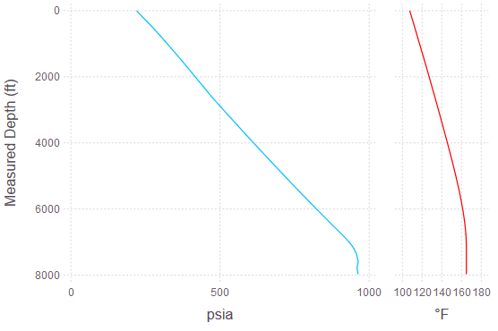

# PressureDrop.jl [](https://travis-ci.org/jnoynaert/PressureDrop.jl)
Julia package for computing multiphase pressure profiles for gas lift optimization of oil &amp; gas wells.

Currently calculates outlet-referenced models for producing wells using non-coupled temperature gradients.

Note that all calculations and inputs are currently in U.S. field units.

# Installation

From the Julia prompt: press `]`, then type `add Julia`.

In Jupyter: execute a cell containing `using Pkg; Pkg.add("PressureDrop")`.

# Usage

```
using PressureDrop

julia> example_well = read_survey(path = path_to_survey, id = 2.441)

Wellbore with 106 segments.
Ends at 7975.0' MD / 7103.84' TVD.
Max inclination 91.8°. Average ID 2.441 in.

julia> pressures, temps = pressure_and_temp(well = example_well, q_o = 250, q_w = 250, GLR = 4500, WHP = 220, roughness =  0.00065,
                                    pressurecorrelation = BeggsAndBrill, dp_est = 25, APIoil = 35, sg_water = 1.1, sg_gas = 0.65,
                                    temperature_method = "Shiu", geothermal_gradient = 1.0, BHT = 165);

Flowing bottomhole pressure of 963.3 psia at 7975.0' MD.
Average gradient 0.121 psi/ft (MD), 0.136 psi/ft (TVD).

julia> using Gadfly #necessary to make integrated plotting functions available

julia> plot_pressureandtemp(example_well, pressures, temps) #expect a long time to first plot due to precompilation; subsequent calls will be faster
```



# Supported correlations

- Beggs and Brill 1973, with Payne correction factors. Best for inclined pipe.
- Hagedorn and Brown 1965, with Griffith and Wallis bubble flow correction.

Neither correlation accounts for oil-water phase slip.

# Performance

The pressure drop calculations converge quickly enough in most cases that special performance considerations do not need to be taken into account during interactive use.

For bulk calculations, note that as always with Julia, the best performance will be achieved by wrapping any calculations in a function, e.g. a `main()` block, to enable proper type inference by the compiler.

Plotting functions are lazily loaded to avoid the overhead of loading the `Gadfly` plotting dependency.
